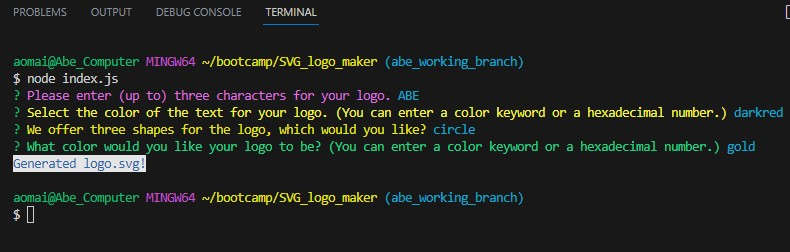

# Abe's SVG-Logo Maker
#    
## Description
This javascript-driven application allows a user to create their own logo and write it to an SVG (Scalable Vector Graphics) file. 

## Table of Contents

- [Installation](#installation)
- [Usage](#usage)
- [Credits](#credits)
- [License](#license)
- [Future Improvements](#future-improvements)

## Installation
All required npm node packages have already been included in this library, therefore no further installation is necessary. 

## Usage
To create the SVG file, the user must first open and run the index.js file from the integrated terminal. The user is then prompted through a series of four questions to determine the details of their logo: 
- The selected characters for the logo (*The application will accept up to three. The user will receive an error alert in the event of an improper entry.*)
- The color of the logo's text (*Users can enter the color as a color keyword or a numerical hexadecimal code.*)
- the shape of the logo (*Users can choose between three options: a circle, a square, or a triangle.*)
- the color of the shape (*As above, users can enter the color as a color keyword or a numerical hexadecimal code.*)

Once the user has correctly selected each of the four parameters necessary for the creation of their logo, the logo is created and written to the Example.svg file. 

To view the SVG, a user can then view the output by inserting the SVG contents into the provided HTML document and opening that document in their selected browser.

## Credits
The following NPM node packages were used in this project:
- [chalk](https://www.npmjs.com/package/chalk)
- [inquirer](https://www.npmjs.com/package/inquirer)

Node's built-in fs module was also used. 

## License
This project uses a standard [MIT License](https://github.com/aomaits/SVG_logo_maker/blob/main/LICENSE).

## Future Improvements

As mentioned above, error-handling is in place for the character limits, but there is no error-handling for incorrectly entered colors, given the wide range of possible accepted results. This is something that could potentially be added in the future. 